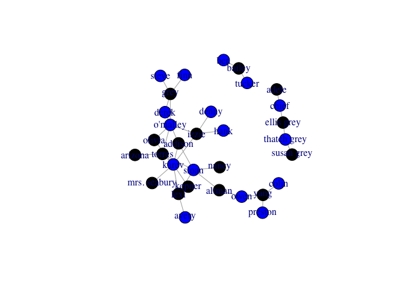
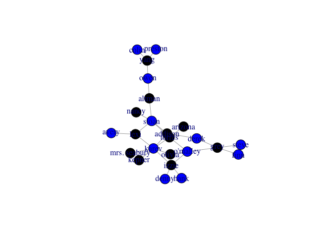
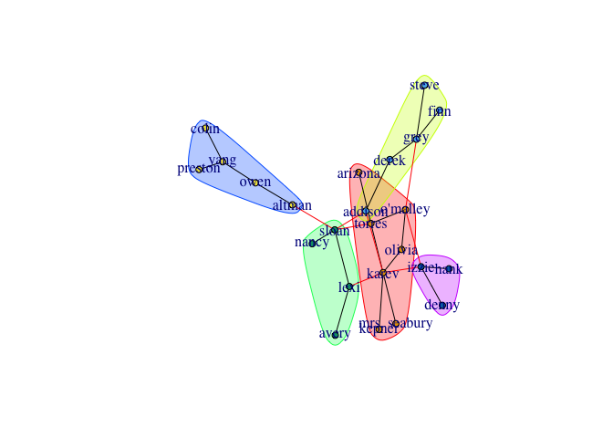
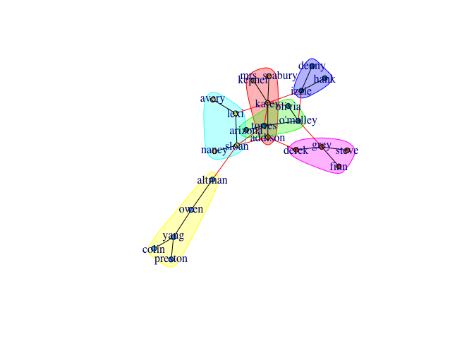
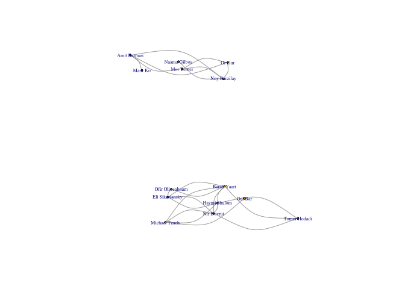

Ass2
================
Amit
5/13/2017

R Markdown
----------

Get the anatomy grey data and create a graph
============================================

take data from two files
========================

``` r
setwd("/Users/amitweiss/Desktop/ga")
library(igraph)
```

    ## 
    ## Attaching package: 'igraph'

    ## The following objects are masked from 'package:stats':
    ## 
    ##     decompose, spectrum

    ## The following object is masked from 'package:base':
    ## 
    ##     union

``` r
ga.data <- read.csv('ga_edgelist.csv', header=T, stringsAsFactors=F)
ga.data2 <- read.csv('ga_actors.csv', header=T, stringsAsFactors=F)
g <- graph.data.frame(ga.data,vertices=ga.data2,directed = F)
g
```

    ## IGRAPH UN-- 32 34 -- 
    ## + attr: name (v/c), gender (v/c)
    ## + edges (vertex names):
    ##  [1] lexi    --sloan        karev   --lexi         owen    --yang        
    ##  [4] altman  --owen         sloan   --torres       altman  --sloan       
    ##  [7] arizona --torres       karev   --torres       derek   --grey        
    ## [10] izzie   --karev        izzie   --o'malley     o'malley--torres      
    ## [13] colin   --yang         preston --yang         karev   --kepner      
    ## [16] addison --sloan        addison --karev        addison --derek       
    ## [19] nancy   --sloan        karev   --olivia       olivia  --o'malley    
    ## [22] grey    --o'malley     karev   --mrs. seabury adele   --chief       
    ## + ... omitted several edges

Coloring the graph
==================

Plot the graph
==============

``` r
V(g)$color <- "blue"
females <- which(V(g)$gender == "F")
V(g)$color[females] <- "black" 
plot(g)
```

 \# Make one connected graph from the data

``` r
c <- components(g, mode="strong")
l_comp <- which.max(c$csize)
g2 <- induced.subgraph(g, V(g)[which(c$membership == l_comp)])
plot(g2)
```



Use betweenness centarilty
==========================

``` r
bet = betweenness(g2, v = V(g2), directed=F,normalized=T)
bet
```

    ##      addison       altman      arizona        avery        colin 
    ##   0.17424242   0.30039526   0.00000000   0.00000000   0.00000000 
    ##        denny        derek         finn         grey         hank 
    ##   0.00000000   0.07094862   0.00000000   0.18524374   0.00000000 
    ##        izzie        karev       kepner         lexi mrs. seabury 
    ##   0.18952569   0.37654809   0.00000000   0.14229249   0.00000000 
    ##        nancy       olivia     o'malley         owen      preston 
    ##   0.00000000   0.01956522   0.21508564   0.23715415   0.00000000 
    ##        sloan        steve       torres         yang 
    ##   0.45599473   0.00000000   0.26541502   0.16996047

``` r
vg_names = V(g2)$name
maxBet <- vg_names[which(bet  == max(bet))]
cat("Max Betweenness name: ", maxBet  , ", value: ", max(bet))
```

    ## Max Betweenness name:  sloan , value:  0.4559947

Use closeness centarilty
========================

``` r
cl = closeness(g2,v = V(g2), normalized=T)
cl
```

    ##      addison       altman      arizona        avery        colin 
    ##    0.3898305    0.3150685    0.2911392    0.2643678    0.1782946 
    ##        denny        derek         finn         grey         hank 
    ##    0.2527473    0.3150685    0.2323232    0.2987013    0.2527473 
    ##        izzie        karev       kepner         lexi mrs. seabury 
    ##    0.3333333    0.3898305    0.2839506    0.3538462    0.2839506 
    ##        nancy       olivia     o'malley         owen      preston 
    ##    0.2839506    0.3150685    0.3650794    0.2584270    0.1782946 
    ##        sloan        steve       torres         yang 
    ##    0.3898305    0.2323232    0.4035088    0.2149533

``` r
vg_names = V(g2)$name
maxcl <- vg_names[which(cl  == max(cl))]
cat("Max Closeness name: ", maxcl  , ", value: ", max(cl))
```

    ## Max Closeness name:  torres , value:  0.4035088

Use eigenvector centarilty
==========================

``` r
eg = evcent(g2, directed=F)$vector
eg
```

    ##      addison       altman      arizona        avery        colin 
    ##  0.553736435  0.207702396  0.210120473  0.153835832  0.007009961 
    ##        denny        derek         finn         grey         hank 
    ##  0.165489626  0.250030245  0.087953295  0.300492721  0.165489626 
    ##        izzie        karev       kepner         lexi mrs. seabury 
    ##  0.565395852  1.000000000  0.292696923  0.525580626  0.292696923 
    ##        nancy       olivia     o'malley         owen      preston 
    ##  0.187856429  0.468519243  0.600697535  0.067803814  0.007009961 
    ##        sloan        steve       torres         yang 
    ##  0.641812107  0.087953295  0.717877288  0.023949556

``` r
vg_names = V(g2)$name
maxEg <- vg_names[which(eg  == max(eg))]
cat("Max Eigenvector name: ", maxEg  , ", value: ", max(eg))
```

    ## Max Eigenvector name:  karev , value:  1

clustering - cluster fast greedy
================================

coloring the graph clustring and plot the coloring graph
========================================================

find the modularity of the graph
================================

find the size of the clustering
===============================

``` r
cfg = cluster_fast_greedy(g2, merges = TRUE, modularity = TRUE,
      membership = TRUE, weights = E(g2)$weight)
cat("the modulairty is : ", modularity(cfg))
```

    ## the modulairty is :  0.4789541

``` r
cat("\nthe size is: ", sizes(cfg),'(5)')
```

    ## 
    ## the size is:  7 5 4 5 3 (5)

``` r
V(g2)$color <- cfg$membership
V(g2)$size <- 5
plot(cfg, g2)
```



clustering - cluster edge betweenness
=====================================

coloring the graph clustring and plot the coloring graph
========================================================

find the modularity of the graph
================================

find the size of the clustering
===============================

``` r
ceb = cluster_edge_betweenness(g2, weights = E(g2)$weight, directed = FALSE,
  edge.betweenness = TRUE, merges = TRUE, bridges = TRUE,
  modularity = TRUE, membership = TRUE)
cat("the modulairty is : ", modularity(ceb))
```

    ## the modulairty is :  0.46875

``` r
cat("\nthe size is: ", sizes(ceb),'(6)')
```

    ## 
    ## the size is:  4 5 4 4 3 4 (6)

color the graph
===============

``` r
V(g2)$color <- ceb$membership
V(g2)$size <- 5
plot(ceb, g2)
```



connect to facebook api
=======================

``` r
library(devtools)
install_github("Rfacebook", "pablobarbera", subdir="Rfacebook")
```

    ## Warning: Username parameter is deprecated. Please use pablobarbera/
    ## Rfacebook

    ## Skipping install of 'Rfacebook' from a github remote, the SHA1 (3a797e79) has not changed since last install.
    ##   Use `force = TRUE` to force installation

``` r
require (Rfacebook)
```

    ## Loading required package: Rfacebook

    ## Loading required package: httr

    ## Loading required package: rjson

    ## Loading required package: httpuv

    ## 
    ## Attaching package: 'Rfacebook'

    ## The following object is masked from 'package:methods':
    ## 
    ##     getGroup

``` r
#fb_oauth <- fbOAuth(app_id="262751134188814", app_secret="6b76a6e3639cc94d26ea280c8b477242",extended_permissions = TRUE)
```

save the fb\_oath
=================

``` r
#save(fb_oauth, file="fb_oauth")
#load("fb_oauth")
```

get users from facebook(only users who use the application)
===========================================================

get friends of the users and create "friends network"
=====================================================

nodes = poeple
==============

edges = connections between the friends
=======================================

the graph contains 17 vertexes
==============================

``` r
token <- 'EAACEdEose0cBAPNu2sjy21iraFeaoyBBap7pMTW4yM4rML48hfsMb29i14s5ebLlPeBTUmg4dTdjjCOhYt5iMfsqB7L2Qiw8HO3B1SdEqjYHH8JvZBg3Upb2gMZAc6dDKNdTcb2ZB4SOZADX9OWCqsvKGIR19ZAbcp7Mpgg9mUO57iThXnJNt'
me <- getUsers("me", token, private_info=TRUE)
me$name
```

    ## [1] "Amit Weiss"

``` r
me$hometown
```

    ## [1] NA

``` r
my_friends <- getFriends(token, simplify = TRUE)
```

    ## Only friends who use the application will be returned
    ## See ?getFriends for more details

``` r
head(my_friends$id, n = 1) # get lowest user ID
```

    ## [1] "10152482839254267"

``` r
my_friends_info <- getUsers(my_friends$id, token, private_info = TRUE)
mat <- getNetwork(token, format = "adj.matrix")
```

    ## Only friends who use the application will be returned
    ## See ?getFriends for more details

    ## 
      |                                                                       
      |                                                                 |   0%
      |                                                                       
      |====                                                             |   6%
      |                                                                       
      |=======                                                          |  11%
      |                                                                       
      |===========                                                      |  17%
      |                                                                       
      |==============                                                   |  22%
      |                                                                       
      |==================                                               |  28%
      |                                                                       
      |======================                                           |  33%
      |                                                                       
      |=========================                                        |  39%
      |                                                                       
      |=============================                                    |  44%
      |                                                                       
      |================================                                 |  50%
      |                                                                       
      |====================================                             |  56%
      |                                                                       
      |========================================                         |  61%
      |                                                                       
      |===========================================                      |  67%
      |                                                                       
      |===============================================                  |  72%
      |                                                                       
      |===================================================              |  78%
      |                                                                       
      |======================================================           |  83%
      |                                                                       
      |==========================================================       |  89%
      |                                                                       
      |=============================================================    |  94%
      |                                                                       
      |=================================================================| 100%

``` r
singletons <- rowSums(mat)==0 # friends who are friends with me alone
my_graph <- graph.adjacency(mat[!singletons,!singletons],mode = c("undirected"))
my_graph
```

    ## IGRAPH UN-- 14 23 -- 
    ## + attr: name (v/c)
    ## + edges (vertex names):
    ##  [1] Mor Terner     --Or Gur          Mor Terner     --Amit Berman    
    ##  [3] Mor Terner     --Noy Barzilay    Haymi Shalom   --Tomer Hodadi   
    ##  [5] Haymi Shalom   --Michael Tzach   Haymi Shalom   --Eli Sikuriansky
    ##  [7] Haymi Shalom   --Nir Dovrat      Haymi Shalom   --Barak Yaari    
    ##  [9] Tomer Hodadi   --Nir Dovrat      Tomer Hodadi   --Barak Yaari    
    ## [11] Gal Bar        --Michael Tzach   Michael Tzach  --Nir Dovrat     
    ## [13] Michael Tzach  --Barak Yaari     Eli Sikuriansky--Nir Dovrat     
    ## [15] Eli Sikuriansky--Barak Yaari     Eli Sikuriansky--Ofir Olivenbaum
    ## + ... omitted several edges

``` r
layout <- layout.drl(my_graph,options=list(simmer.attraction=0))
```

Plot the firends network
========================

We can see that there is two groups of friends
==============================================

``` r
plot(my_graph, vertex.size=2, 
     #vertex.label=NA, 
     vertex.label.cex=0.5,
     edge.arrow.size=0, edge.curved=TRUE,layout=layout)
```



Doing the proccess of stage one again
=====================================

``` r
bet = betweenness(my_graph, v = V(my_graph), directed=F,normalized=T)
bet
```

    ##      Mor Terner    Haymi Shalom    Tomer Hodadi         Gal Bar 
    ##      0.00000000      0.02136752      0.00000000      0.00000000 
    ##   Michael Tzach Eli Sikuriansky      Nir Dovrat     Barak Yaari 
    ##      0.07692308      0.01282051      0.02136752      0.07264957 
    ##          Or Gur     Amit Berman         Maor Ko    Noy Barzilay 
    ##      0.00000000      0.05128205      0.00000000      0.05128205 
    ## Ofir Olivenbaum    Naama Gilboa 
    ##      0.00000000      0.00000000

``` r
vg_names = V(my_graph)$name
maxBet <- vg_names[which(bet  == max(bet))]
cat("Max Betweenness name: ", maxBet  , ", value: ", max(bet))
```

    ## Max Betweenness name:  Michael Tzach , value:  0.07692308

``` r
cl = closeness(my_graph,v = V(my_graph), normalized=T)
cl
```

    ##      Mor Terner    Haymi Shalom    Tomer Hodadi         Gal Bar 
    ##       0.1092437       0.1397849       0.1354167       0.1300000 
    ##   Michael Tzach Eli Sikuriansky      Nir Dovrat     Barak Yaari 
    ##       0.1382979       0.1368421       0.1397849       0.1413043 
    ##          Or Gur     Amit Berman         Maor Ko    Noy Barzilay 
    ##       0.1092437       0.1101695       0.1065574       0.1101695 
    ## Ofir Olivenbaum    Naama Gilboa 
    ##       0.1340206       0.1065574

``` r
vg_names = V(my_graph)$name
maxcl <- vg_names[which(cl  == max(cl))]
cat("Max Closeness name: ", maxcl  , ", value: ", max(cl))
```

    ## Max Closeness name:  Barak Yaari , value:  0.1413043

``` r
eg = evcent(my_graph, directed=F)$vector
eg
```

    ##      Mor Terner    Haymi Shalom    Tomer Hodadi         Gal Bar 
    ##       0.0000000       0.9248056       0.6554920       0.1592060 
    ##   Michael Tzach Eli Sikuriansky      Nir Dovrat     Barak Yaari 
    ##       0.6921139       0.7479832       0.9248056       1.0000000 
    ##          Or Gur     Amit Berman         Maor Ko    Noy Barzilay 
    ##       0.0000000       0.0000000       0.0000000       0.0000000 
    ## Ofir Olivenbaum    Naama Gilboa 
    ##       0.4020861       0.0000000

``` r
vg_names = V(my_graph)$name
maxEg <- vg_names[which(eg  == max(eg))]
cat("Max Eigenvector name: ", maxEg  , ", value: ", max(eg))
```

    ## Max Eigenvector name:  Barak Yaari , value:  1

``` r
cfg = cluster_fast_greedy(my_graph, merges = TRUE, modularity = TRUE,
      membership = TRUE, weights = E(my_graph)$weight)
cat("the modulairty is : ", modularity(cfg))
```

    ## the modulairty is :  0.4536862

``` r
cat("\nthe size is: ", sizes(cfg),'(2)')
```

    ## 
    ## the size is:  8 6 (2)

``` r
ceb = cluster_edge_betweenness(my_graph, weights = E(my_graph)$weight, directed = FALSE,
  edge.betweenness = TRUE, merges = TRUE, bridges = TRUE,
  modularity = TRUE, membership = TRUE)
cat("the modulairty is : ", modularity(ceb))
```

    ## the modulairty is :  0.4536862

``` r
cat("\nthe size is: ", sizes(ceb),'(2)')
```

    ## 
    ## the size is:  6 8 (2)

\`\`\`
